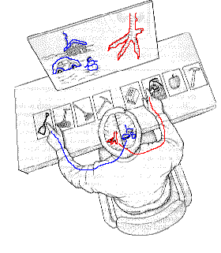

# Buddhism Cheat Sheet

**Buddhism** is the world's fourth-largest religion with over 520 million followers, 
or over 7% of the global population. Buddhism encompasses a variety of traditions, beliefs 
and spiritual practices largely based on original teachings attributed to the Buddha and resulting 
interpreted philosophies.

## Table of Contents

- [Four Noble Truths](#four-noble-truths)
  - [Evolutionary Psychology and Four Noble Truths](#evolutionary-psychology-and-four-noble-truths)
- [Non-Self](non-self)
  - [Evolutionary Psychology and Non-Self](#evolutionary-psychology-and-non-self)
- [Resources](#resources)

## Four Noble Truths

The Four Truths express the basic orientation of Buddhism: we **crave and cling** to impermanent states and things, 
which is **dukkha**. But there is a way to liberation from dukkha to the state of **nirvana**, namely following the 
**Noble Eightfold Path**.

- **1. The existence of suffering** (dukkha). Dukkha is most commonly translated as "suffering", but this is inaccurate, 
since it refers not to episodic suffering, but to the intrinsically unsatisfactory nature of temporary states and 
things, including pleasant but temporary experiences. Dukkha can be translated as "*incapable of satisfying*" 
instead of suffering.
- **2. The cause of suffering** - craving and clinging to impermanent things: sense-pleasures, life, craving to not 
experience the painful feelings.
- **3. The cessation of suffering** - Nirvana - extinction of craving, peace of mind.
- **4. The eightfold path** - the path to Nirvana:
  - Right view
  - Right thought
  - Right speech
  - Right action
  - Right livelihood
  - Right effort
  - Right mindfulness
  - Right concentration

### Evolutionary Psychology and Four Noble Truths

[Dopamine](https://en.wikipedia.org/wiki/Dopamine) is believed to be responsible for craving and clinging to 
pleasurable things such as food, sex, positive emotions. It's an evolutionary mechanism for attracting humans to things
that are favorable for survival and transmitting our genes to the next generation.

Another evolutionary mechanism is positive and negative **emotions**, i.e. something favorable for our survival can cause 
happiness or surprise, and something dangerous can cause anger, fear, sadness, disgust. 

The emotions **can't be trusted** because they have been "designed" by evolution long time ago and optimized for an 
environment different from where we live now. The environment was more dangerous and competitive millions of years ago.
Even millions of years is not enough for evolution to *apply changes* to the original design.

[Default mode network](https://en.wikipedia.org/wiki/Default_mode_network) in the brain is activated when a person is 
not doing anything in particular e.g. daydreaming or mind-wandering. At this point he is usually 
thinking about something in the past or the future, and the things that have a strong negative or positive connotation, 
in other words emotional things. When meditating the default mode is much less active in the brain. 
By meditating we prohibit our brain to be reactive and instead be more objective.
Meditation can be thought of as an exercise in which we suppress our brain in reacting to things with strong emotional 
connotation.

## Non-Self

[Annata](https://en.wikipedia.org/wiki/Anatta) refers to the doctrine of "**non-self**", that there is no unchanging, 
permanent self, soul or essence in living beings.

**The structure of the Buddha's argument of non-self**:
 
There are **5 aggregates** that constitute *everything* there is about a person:

- Body
- Perception 
- Feeling
- Mental formations
- Consciousness

All of these aggregates are:

- Impermanent (i.e. they don't persist through time, changeable)
- Not under our control 

A *self* is something that's permanent and something we can control, thus there is no *self*.

It can be interpreted as - a person is nothing more than a biological robot. There is no command center or a soul
that controls it. Everything is guided by the laws of the Universe. These laws are the one and only self. 
The *individual self* is just a delusion. 
 
### Evolutionary Psychology and Non-Self

Split brain experiment (The Corpus Callosum has been severed, a treatment for epilepsy):
 

 
- The left brain dominates for language, speech, and problem solving
- The right brain dominates for visual-motor tasks 

1. Each hemisphere was presented a picture that related to one of four cards placed in front of the split-brain subject. 
The right hemisphere saw the picture on the left (a snow scene), and the left hemisphere saw the picture on the right 
(a chicken foot).  Both hemispheres could see all of the cards.
2. The left and right hemispheres easily picked the card that related to the picture it saw. 
The left hand pointed to the right hemisphere's choice, and the right hand pointed to the left hemisphere's choice.
3. The patient was then asked why the left hand was pointing to the shovel. 
Only the left hemisphere can talk, and it did not know the answer because the decision to point to the shovel was 
made in the right hemisphere.
4. Immediately the left hemisphere made up a story about what it could see - the chicken.  It said the right hemisphere 
chose the shovel to clean out a chicken shed.

This experiment suggests (doesn't prove as the experiment is done on people with severed brain) that:
- the conscious self is capable of greatly overestimating the amount of influence it's exerting on behaviour.
- the conscious self can promulgate and believe wildly untrue stories about the actual motivation of a person.

### Delusions About Ourselves

People tend to present themselves to others as beneficial and effective. It's an evolutionary adaptation. An experiment 
that shows this is asking authors of multi-author scientific papers what was their contribution - the average 
total contribution is around 140%.  

**Beneffectance** - perception of responsibility for desired outcomes, but not for undesired ones.

People are more inclined to remember events that reflect favorably on us than events that reflect unfavorably on us.
The studies show that we remember positive events in greater detail than the negative events. The hypothesis is that
we are designed to remember positive events in greater detail for sharing it with others, the negative events we 
remember but don't need to share. This doesn't translate to other people, i.e. we remember negative events that 
happened to other people in just as detailed a fashion as we remember the positive events.

### Modularity of Mind

[Modularity of mind](https://en.wikipedia.org/wiki/Modularity_of_mind) is the notion that a mind may, at least in part, 
be composed of innate neural structures or modules which have distinct established evolutionarily developed functions. 

### Evolutionary Function of Self

"It is possible to argue that the primary evolutionary function of the self is to be the organ of impression management,
rather than a decision maker" -- Jerome Barkov, 1989. 

Self control is nothing more than your brain rehearsing excuses 
for your actions to tell them to others when asked. If you don't have these reasons you will be excluded from the group 
as someone who does unreasonable things and thus unpredictable.
 
## Resources

- Buddhism and Modern Psychology: course on Coursera https://www.coursera.org/learn/science-of-meditation
   
